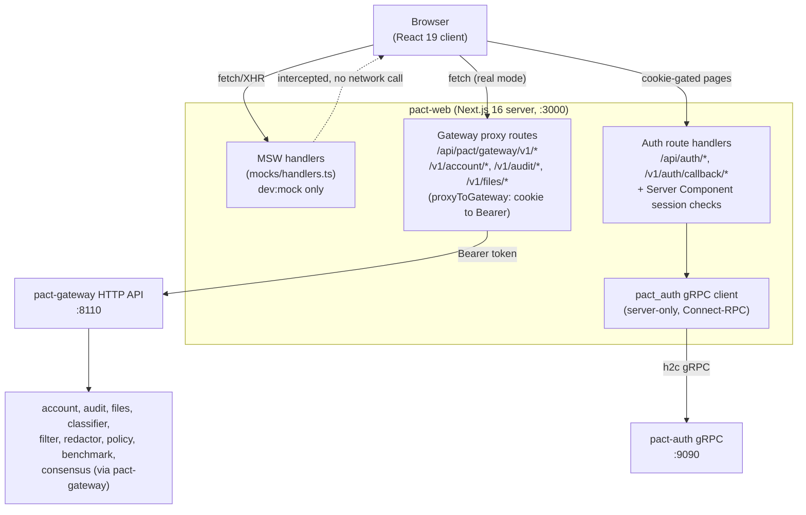

# pact-web

Frontend for the [PACT Toolkit](https://github.com/orgs/PACT-Toolkit/repositories), a suite of services for data privacy, policy enforcement, and compliance automation.

Built with Next.js 16 (App Router), React 19, Tailwind CSS, and shadcn/ui.

For AI-assistant and agent guidance (commands, module boundaries, feature folder structure, gotchas) see [AGENTS.md](AGENTS.md), the canonical source (`CLAUDE.md` is a symlink to it).

---

## Architecture

pact-web is the single browser-facing app for PACT.
Almost all backend traffic is proxied server-side through `pact-gateway`; the one exception is authentication, which talks directly to `pact-auth` over gRPC from Server Components and route handlers.
In `dev:mock`, MSW intercepts every request (browser Service Worker and Node) before either path is reached, so the app runs with no backend at all.



This topology (BFF-in-route-handlers, httpOnly-cookie-to-Bearer, contract-first
codegen, SWR-only data layer, MSW mock-first) is settled; ongoing hardening builds on
it rather than reshaping it:
decision values become closed enums in the gateway OpenAPI slice so codegen emits
literal unions, runtime-parsed at every boundary instead of `as`-cast (an unknown
verdict renders as an explicit unknown state, never fail-open allow), the
`pact.auth`/`pact.account`/`pact.files` audit payload shapes are vendored from
pact-contracts schema modules exactly like `pact.decisions`, the decision vocabulary
moves out of the audit slice into a shared location, eslint-boundaries covers the full
tree with `no-unknown-files`, the domain/slice conventions are machine-enforced, and
per-group plus global error boundaries keep the shell alive through feature render
errors.

Notes on what each edge is, verified against the code:

- **Gateway proxy routes** - `app/api/pact/[...path]/route.ts` (catch-all for classifier/filter/policy/config/benchmark/rules) and the explicit `app/v1/{account,audit,files}/[...path]/route.ts` routes all call the shared `proxyToGateway()` helper (`src/lib/proxy/proxy_to_gateway.ts`).
  It translates the `pact_session` cookie into an `Authorization: Bearer` header, forwards to `PACT_GATEWAY_URL`, and rolls a rotated session cookie forward if the gateway mints one.
- **Auth is the one direct backend dependency.**
  `src/framework/auth/pact_auth/client.ts` is the only place in the app that opens a gRPC client (Connect-RPC over h2c) against `PACT_AUTH_GRPC_ADDR`, used by login, register, MFA, passkey, OAuth, and session-validation code under `app/api/auth/*` and `app/(app)/layout.tsx`.
- **Edge `proxy.ts`** (Next.js 16's renamed `middleware.ts`) is a cheap cookie-existence gate that redirects unauthenticated requests to `/login`; it does not validate the session itself and is skipped entirely when `NEXT_PUBLIC_API_MOCKING=enabled`.
- **Mock mode** wires the same `mocks/handlers.ts` array into three runtimes: the browser Service Worker (`mocks/browser.ts`), the Next.js Node runtime (`instrumentation.ts`, so Server Components and route handlers are covered too), and Vitest (`vitest.setup.ts`).
  See the `pact-dev-mock` skill for the full auto-login and persona-switching mechanics.

---

## Routes

Real Next.js routes live at the repo root in `app/`, split into two route groups.
Feature _logic_ (domain, UI, mocks, tests) lives separately in `src/app/{feature}/` and is imported into these thin route pages - see [Feature folders](#feature-folders).

| Route group | Path                                                        | Feature module                     |
| ----------- | ----------------------------------------------------------- | ---------------------------------- |
| `(app)`     | `/dashboard`                                                | `src/app/dashboard`                |
| `(app)`     | `/test-lab`                                                 | `src/app/test_lab`                 |
| `(app)`     | `/classifier`                                               | `src/app/classifier`               |
| `(app)`     | `/filter`                                                   | `src/app/filter`                   |
| `(app)`     | `/redactor`                                                 | `src/app/redactor`                 |
| `(app)`     | `/policy`                                                   | `src/app/policy`                   |
| `(app)`     | `/audit`                                                    | `src/app/audit`                    |
| `(app)`     | `/benchmark`                                                | `src/app/benchmark`                |
| `(app)`     | `/consensus`                                                | `src/app/consensus`                |
| `(app)`     | `/gateway`                                                  | `src/app/gateway`                  |
| `(app)`     | `/files`                                                    | `src/app/files`                    |
| `(app)`     | `/settings/account` (+ `consents`, `danger`, `preferences`) | `src/app/account`                  |
| `(app)`     | `/settings/security`                                        | `src/app/account` + `src/app/auth` |
| `(auth)`    | `/login` (+ `/login/mfa`)                                   | `src/app/auth`                     |
| `(auth)`    | `/register`                                                 | `src/app/auth`                     |
| `(auth)`    | `/forgot-password`, `/reset-password`                       | `src/app/auth`                     |
| `(auth)`    | `/verify-email`                                             | `src/app/auth`                     |

`/` itself has no route group; it redirects to `/dashboard?intro=1` (authenticated) or `/login?intro=1` (not) - see `app/page.tsx`.

`app/api/` and `app/v1/` hold route handlers, not pages: the auth gRPC bridge (`app/api/auth/**`) and the gateway proxy routes described above.

---

## Data fetching

- REST calls use [SWR](https://swr.vercel.app/) via hooks generated by [Orval](https://orval.dev/) from each backend service's OpenAPI spec.
  Config is in `orval.config.ts`; generated output lands in `src/__codegen__/rest/{service}/` (`hooks.ts` + `types/`) and is never hand-edited.
- Each Orval group's `baseUrl` is either a specific proxy route (`/v1/account`, `/v1/audit`, `/v1/files`) or the shared gateway prefix `/api/pact/gateway/v1` (benchmark, check, classifier, config, filter, policy, rules) - both resolve to the proxy routes in [Architecture](#architecture).
- `pnpm api:update` downloads each service's `swagger.yaml` (per `schema/{service}/services.config.json`) and regenerates hooks; `pnpm rest:codegen` regenerates hooks from the specs already vendored in `schema/`.
  Both the vendored specs and the generated output are committed.
- Server-side fetches (Server Components, route handlers) use `getApiBaseUrl()` (`src/framework/helpers/api_base_url.ts`) to build an absolute URL back to the app's own dev server, so the same request passes through MSW in `dev:mock` or the real proxy in `dev`/`dev:real` with no code-path divergence.
  Client-side code uses relative paths.

See the `swr-best-practices` and `pact-react-patterns` skills for the rules on when to reach for SWR vs. other state.

---

## Environment variables

There is no `.env.example` in this repo; environment is layered per-mode in `env/*.env`, loaded by `env-cmd` (see [Scripts](#scripts)).
Values as of this writing:

| Variable                         | `env/local.env` (mock)  | `env/local-real.env` (real) | `env/demo.env`                           |
| -------------------------------- | ----------------------- | --------------------------- | ---------------------------------------- |
| `NEXT_PUBLIC_API_MOCKING`        | `enabled`               | `disabled`                  | `disabled`                               |
| `PACT_GATEWAY_URL`               | `http://localhost:8080` | `http://localhost:8110`     | `https://api-demo.pact.example.com`      |
| `PACT_AUTH_GRPC_ADDR`            | `http://localhost:9090` | `http://localhost:9090`     | `https://auth-demo.pact.example.com:443` |
| `NEXT_PUBLIC_VERCEL_ENVIRONMENT` | `development`           | `development`               | `preview`                                |
| `NEXT_PUBLIC_MSW_DEBUG`          | `true`                  | `false`                     | (unset)                                  |

`env/local.env`'s `PACT_GATEWAY_URL` value is unused while mocking is enabled (nothing reaches the network) but is left pointed at pact-gateway's default port for parity.
`env/local-real.env`'s `:8110` matches pact-gateway's canonical dev HTTP port; `:9090` matches pact-auth's canonical gRPC port.
See `.github-private/doc/DEVPORTS.md` for the full port allocation across every PACT service.

---

## Getting started

### Prerequisites

- Node.js 20+
- pnpm 9+

### Install

```bash
pnpm install
pnpm run msw:init   # one-time MSW service worker setup
```

### Develop

There are three dev modes, backed by three scripts:

```bash
pnpm run dev:mock   # env/local.env - MSW mocks everything, no backend needed (most common)
pnpm run dev:real   # env/local-real.env - talks to a real pact-gateway (:8110) and pact-auth (:9090) running locally
pnpm run dev        # `vercel env pull` then .env.local - talks to whatever backend the linked Vercel project's env points at
```

`pnpm run start` aliases to `dev:mock`.
The app always runs at [http://localhost:3000](http://localhost:3000) regardless of mode.

`pnpm run dev` requires the Vercel CLI to be linked and authenticated (`pnpm run vercel:link`).
Which backend it reaches depends on the pulled environment, not a value fixed in this repo - confirm with whoever manages the Vercel project if that matters for your task.

---

## Scripts

Names quoted verbatim from `package.json`:

```bash
pnpm run dev:mock        # Dev server, MSW mocked data
pnpm run dev:real        # Dev server against a local real backend
pnpm run dev             # Dev server, Vercel-pulled env
pnpm run build           # Production build
pnpm run test            # Unit tests (Vitest)
pnpm run test:watch      # Unit tests in watch mode
pnpm run pw:run          # Playwright E2E, headless
pnpm run pw:open         # Playwright E2E, UI mode
pnpm run lint            # TypeScript check + ESLint (both must pass before committing)
pnpm api:update          # Fetch swagger specs + regenerate REST hooks + vendored-schema types
pnpm rest:codegen        # Regenerate REST hooks only, from specs already in schema/
pnpm proto:gen           # Regenerate pact-auth proto stubs (src/__codegen__/proto)
```

To run a single Vitest file: `TZ=CET vitest run src/app/my_feature/test/my_test.test.ts`.

---

## Project structure

```
app/                  # Real Next.js App Router routes (route groups, layouts, route handlers)
├── (app)/            # Authenticated app shell - one folder per top-level page
├── (auth)/           # Login, register, password reset, MFA
├── api/              # Route handlers: auth gRPC bridge, gateway proxy
└── v1/               # Route handlers: account/audit/files gateway proxy

src/
├── app/              # Feature modules (one folder per feature - see below)
├── components/ui/    # shadcn/ui components (owned by this repo, edit freely)
├── framework/        # Lowest layer: auth client, http, msw, swr helpers - never imports app/
├── lib/              # Cross-cutting helpers (e.g. proxy_to_gateway)
└── __codegen__/      # Orval REST hooks + proto stubs (DO NOT EDIT)

schema/               # Vendored OpenAPI specs per backend service, input to Orval
mocks/                # MSW handler array, browser/server/index bootstrap
e2e/, playwright/     # Playwright E2E specs and fixtures
```

### Feature folders

Every feature under `src/app/{feature}/` follows the same shape (verified against `classifier`, `policy`, `audit`, etc.):

```
src/app/{feature}/
├── domain/     # Business logic, types, contexts, validation schemas
├── ui/         # React components, one component per file, feature-prefixed name
├── mock/       # MSW mock data + handlers for this feature
├── test/       # Unit and E2E tests for this feature
└── index.ts    # Barrel export - the feature's public API
```

Module imports are one-directional and ESLint-enforced: `app` can import `app`/`contexts`/`framework`; `framework` cannot import `app` or `contexts`.
See AGENTS.md for the full boundary table.

---

## Conventions

Full detail lives in `.agents/skills/`; this is a pointer index, not a restatement:

| Convention                                                               | Skill                                            |
| ------------------------------------------------------------------------ | ------------------------------------------------ |
| One component per file, feature-prefixed names (`PolicyDetailSideSheet`) | `pact-component-naming`                          |
| What belongs in `domain/` vs. UI-only visual state                       | `pact-domain-layer`                              |
| SWR-first data fetching, banned `useEffect` patterns                     | `pact-react-patterns`, `swr-best-practices`      |
| `MockRepository<T>` pattern, `mock/data` vs. `mock/handlers`             | `pact-mock-data`                                 |
| `isMock()`, MSW bootstrap, auto-login, persona switching                 | `pact-dev-mock`                                  |
| Playwright E2E structure                                                 | `writing-e2e-tests`, `playwright-best-practices` |
| Vitest unit test structure                                               | `writing-unit-tests`                             |
| shadcn/ui usage                                                          | `shadcn`                                         |

Run `ls .agents/skills` to see what's installed locally; `.claude/skills` and `.cursor/skills` are symlinks to the same directory.

---

## Backend services

pact-web reaches every one of these except pact-auth exclusively through pact-gateway's HTTP proxy (see [Architecture](#architecture)).
Service repositories are private; contact the maintainers for access.

| Service         | Role                                                                                                 |
| --------------- | ---------------------------------------------------------------------------------------------------- |
| pact-gateway    | API gateway - single entry point for pact-web; enforces rate limits and quotas                       |
| pact-auth       | Authentication, sessions, MFA, passkeys, OAuth - reached directly over gRPC, not through the gateway |
| pact-account    | Account profile, consents, preferences                                                               |
| pact-files      | File upload/storage                                                                                  |
| pact-classifier | Classifies data for sensitivity, category, and prompt injection patterns                             |
| pact-policy     | Policy management, evaluation, and agent scope/permission definitions                                |
| pact-redactor   | Redacts sensitive data and system prompt patterns from inputs and outputs                            |
| pact-filter     | Filters content against policy rules, bidirectionally on inputs and outputs                          |
| pact-audit      | Audit trail and event logging                                                                        |
| pact-consensus  | Fans classification requests to multiple classifier backends and returns a majority verdict          |
| pact-benchmark  | Performance benchmarking, corpus runs, and Test Lab run history                                      |

---

## Tech stack

| Layer           | Tool                                     |
| --------------- | ---------------------------------------- |
| Framework       | Next.js 16 (App Router)                  |
| UI library      | React 19                                 |
| Styling         | Tailwind CSS                             |
| Components      | shadcn/ui + Radix primitives             |
| Data fetching   | SWR + Orval-generated REST hooks         |
| Auth transport  | Connect-RPC (gRPC over h2c) to pact-auth |
| API mocking     | MSW                                      |
| Testing         | Vitest (unit) and Playwright (E2E)       |
| Package manager | pnpm                                     |
