# pact-web - architecture

C4 Level 3/4 views of pact-web, plus its dynamic views.
Like the README diagram, these show the target architecture the project is converging on; pieces not yet merged are marked "(planned)".

## Component diagram (C4 L3)

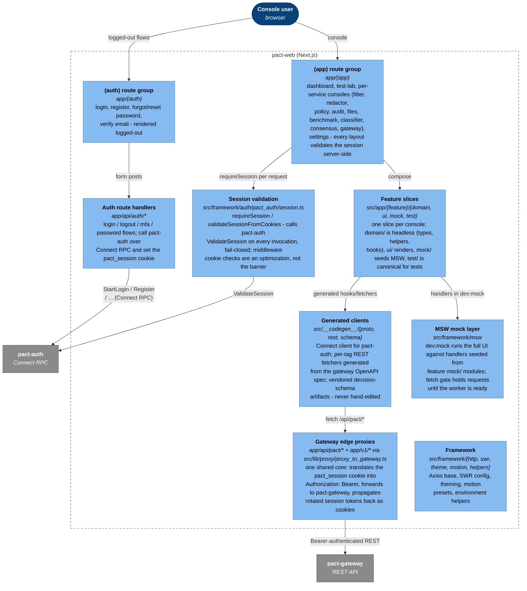

## Class diagram (C4 L4) - session and proxy core

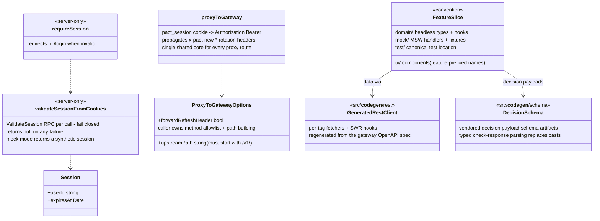

The cookie is never trusted directly: only what pact-auth's ValidateSession says about it counts, so a stale or forged cookie degrades to a login redirect rather than a stale identity.

## Class diagram (C4 L4) - feature-slice anatomy

Every console under `src/app/{feature}` repeats the same shape.
The route page renders the feature's workbench component, the domain layer holds the headless types and hooks, and the mock layer seeds MSW so `dev:mock` runs the full UI offline.
The classes here are the conventions each slice instantiates; the diagrams after this one show the concrete domain layer per feature.

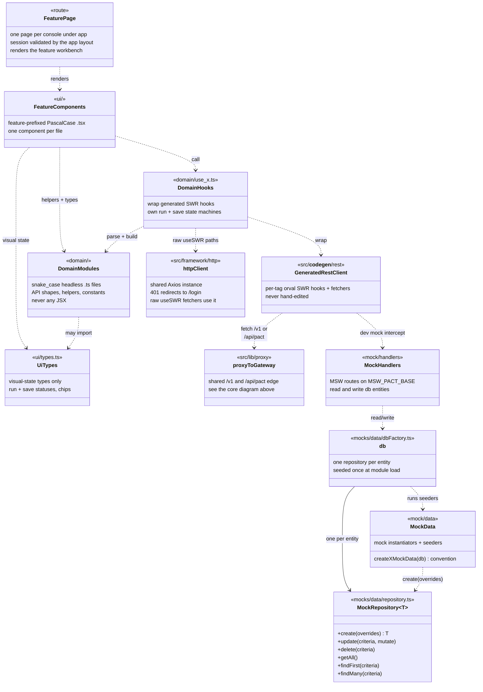

The generated clients fetch `/v1/{account,audit,files}` or `/api/pact/gateway/v1` depending on the tag - both are routes on the shared proxy core, so every feature gets cookie-to-Bearer translation and session rotation for free.

## Class diagram (C4 L4) - decision vocabulary and its consoles

Six features render the same `pact.decisions` payload, so the vocabulary lives in `src/lib/decisions` rather than in any one slice.
The audit workbench decodes every topic it knows through `AUDIT_TOPIC_REGISTRY`, and the dashboard derives its live stream and severity buckets from the same payloads.

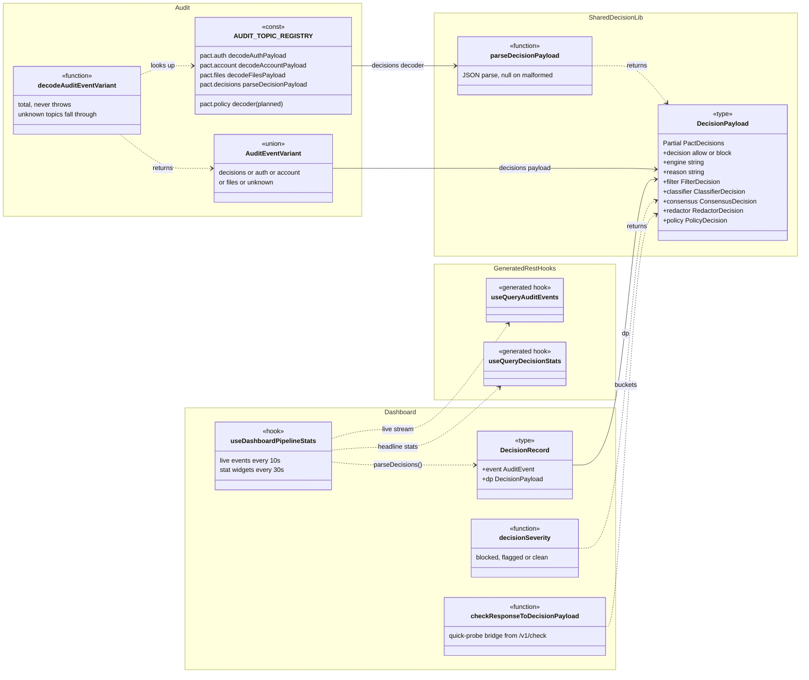

`AUDIT_TOPIC_REGISTRY` is the single source of truth for the topics the audit console can render: the topic dropdown, the decoder dispatch, and the variant kinds all derive from its entries.
A `pact.policy` decoder is the one planned addition - until it lands, that topic falls through to the `unknown` variant and renders as raw JSON.

## Class diagram (C4 L4) - engine console domain records

The filter, classifier, consensus, and redactor consoles each pair the shared payload with their own record type and extraction helper.
Their workbenches fetch `pact.decisions` rows through the generated `useQueryAuditEvents` hook and map them with the extract functions shown here.

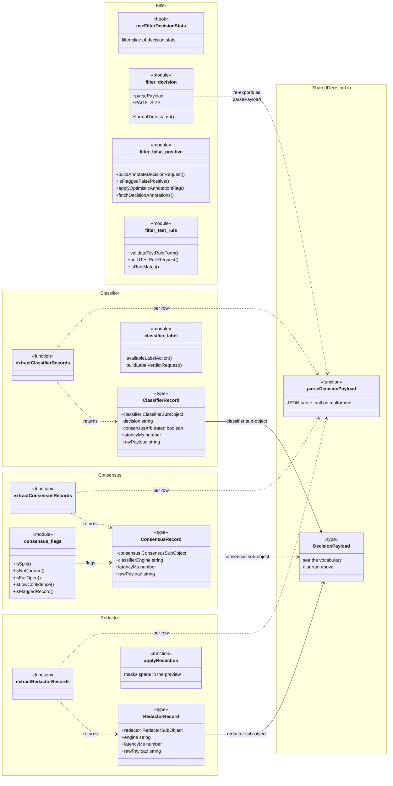

The filter console's false-positive flags ride the audit tag's `annotateDecision` and `listDecisionAnnotations` fetchers, keyed on request id, and its rule sandbox posts through the generated `useTestRule` hook.
`buildLabelVerdictRequest` feeds the classifier tag's `useLabelVerdict` mutation, and `applyRedaction` previews the spans returned by the shared `/v1/check` probe.

## Class diagram (C4 L4) - test lab and benchmark

The Test Lab and the benchmark console share the gateway's benchmark tag: measured runs, Test Lab run history, and the attack corpus.
`useTestLabRun` owns the run state machine, validates every `/v1/check` response with `parseCheckResponse`, and saves history optimistically through the generated benchmark hooks.

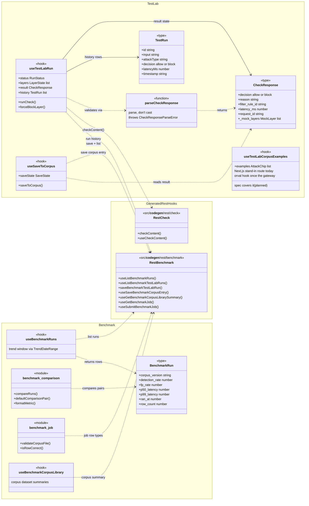

The attack-example chips still come from a Next.js stand-in route wrapped by `useTestLabCorpusExamples`.
The generated corpus-examples hook replaces it once the gateway OpenAPI spec covers the endpoint (planned).

## Class diagram (C4 L4) - control plane and platform features

Gateway configuration, policy authoring, file uploads, account settings, and the auth domain helpers.
The gateway probe builders (sandbox, diagnostics, spotlight) produce request bodies for the same shared `/v1/check` fetcher the Test Lab uses.

```mermaid
classDiagram
    direction LR
    namespace Gateway {
        class GatewayConfig {
            <<type>>
            +classifierEnforceMode
            +vectorEnforceMode
            +consensusMode
            +consensusThreshold
            +sandboxEnabled
            +diagnosticsEnabled
            +spotlightFormat
            +requestTimeoutSeconds
        }
        class useGatewayConfig {
            <<hook>>
        }
        class gateway_enforcement_patch {
            <<module>>
            +buildEnforcementPatch()
            +applyOptimisticEnforcementPatch()
            +isFlipToEnforce()
        }
        class gateway_sandbox {
            <<module>>
            +buildSandboxProbeRequest()
            +verdictBadgeClass()
        }
        class gateway_diagnostics {
            <<module>>
            +buildDiagnosticsProbeRequest()
            +causalSpansToHighlights()
        }
        class gateway_spotlight {
            <<module>>
            +buildSpotlightProbeRequest()
            +trustBadgeClass()
        }
    }
    namespace Policy {
        class PolicyRule {
            <<type>>
            gateway wire type alias
            status draft to revoked
        }
        class usePolicyRules {
            <<hook>>
        }
        class usePolicyRuleActions {
            <<hook>>
            +publishRule()
            +revokeRule()
            throws RuleActionError
        }
        class usePolicyEvents {
            <<hook>>
        }
        class policy_token {
            <<module>>
            +buildIssueTokenRequest()
            +isIssueTokenInputValid()
            +formatExpiry()
        }
    }
    namespace Files {
        class uploadFile {
            <<function>>
            presign, PUT, confirm
        }
        class UploadFileResult {
            <<union>>
            ok with fileId
            or failure step + status
        }
        class files_upload {
            <<module>>
            +isTerminal()
            +humanSize()
            +POLL_INTERVAL_MS
        }
    }
    namespace Account {
        class account_validation_schema {
            <<module>>
            +profileFormSchema
            +ProfileFormData
            +PROFILE_FIELD_TO_MASK
        }
    }
    namespace Auth {
        class auth_validation_schema {
            <<module>>
            +loginSchema
            +registerSchema
            +forgotPasswordSchema
            +resetPasswordSchema
        }
        class webauthn {
            <<module>>
            +signInWithPasskey()
            +enrollPasskey()
            +PasskeyError
        }
        class auth_broadcast {
            <<module>>
            +notifyVerified()
            +subscribeToVerified()
            +notifyPasswordResetCompleted()
        }
    }
    namespace GeneratedRestHooks {
        class RestConfig {
            <<src/__codegen__/rest/config>>
            +useGetConfig()
            +patchEnforcement()
        }
        class RestRules {
            <<src/__codegen__/rest/rules>>
            +useListRules()
            +createRule()
            +publishRule()
            +revokeRule()
        }
        class RestPolicy {
            <<src/__codegen__/rest/policy>>
            +issueToken()
        }
        class RestAudit {
            <<src/__codegen__/rest/audit>>
            +useQueryPolicyEvents()
        }
        class RestFiles {
            <<src/__codegen__/rest/files>>
            +useListFiles()
            +requestFileUpload()
            +confirmFileUpload()
            +deleteFile()
        }
        class RestAccount {
            <<src/__codegen__/rest/account>>
            +useGetAccountProfile()
            +useUpdateAccountProfile()
            +useGetAccountPreferences()
            +useUpdateAccountPreferences()
            +useGetAccountConsents()
            +useRecordAccountConsent()
            +useExportAccountData()
            +useRequestAccountErasure()
        }
    }

    useGatewayConfig ..> RestConfig : useGetConfig
    useGatewayConfig ..> GatewayConfig : returns
    gateway_enforcement_patch ..> RestConfig : patchEnforcement
    gateway_enforcement_patch ..> GatewayConfig : optimistic patch
    usePolicyRules ..> RestRules : useListRules
    usePolicyRules ..> PolicyRule : returns
    usePolicyRuleActions ..> RestRules : publish + revoke
    usePolicyEvents ..> RestAudit : policy events
    policy_token ..> RestPolicy : issueToken
    uploadFile ..> RestFiles : presign + confirm
    uploadFile ..> UploadFileResult : returns
    account_validation_schema ..> RestAccount : validates forms for
```

The account settings forms pair `profileFormSchema` with the account tag's profile, preferences, consents, export, and erasure hooks.
Auth's domain modules never touch the gateway proxy: the forms post to the `/api/auth/*` route handlers, which speak Connect RPC to pact-auth (see the component diagram), and `auth_broadcast` fans auth events out across open tabs.

## Sequence - login

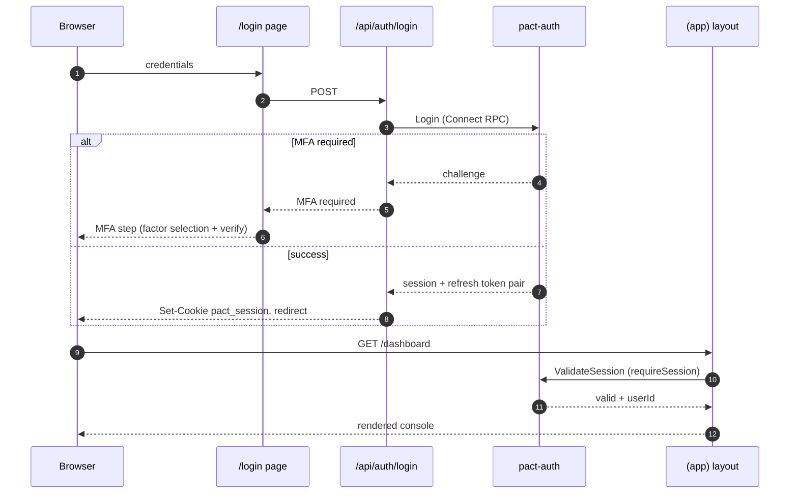

## Sequence - proxied API call with session rotation

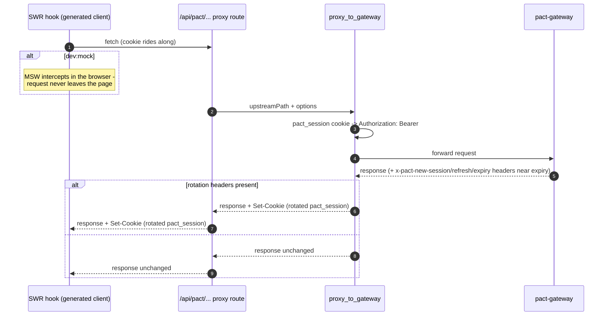

Rotation is transparent to feature code: the SPA never handles raw tokens - the proxy layer owns the cookie-to-Bearer translation and the rotated pair, so a new endpoint gets both for free by declaring a route on the shared core.

## State diagram - client session

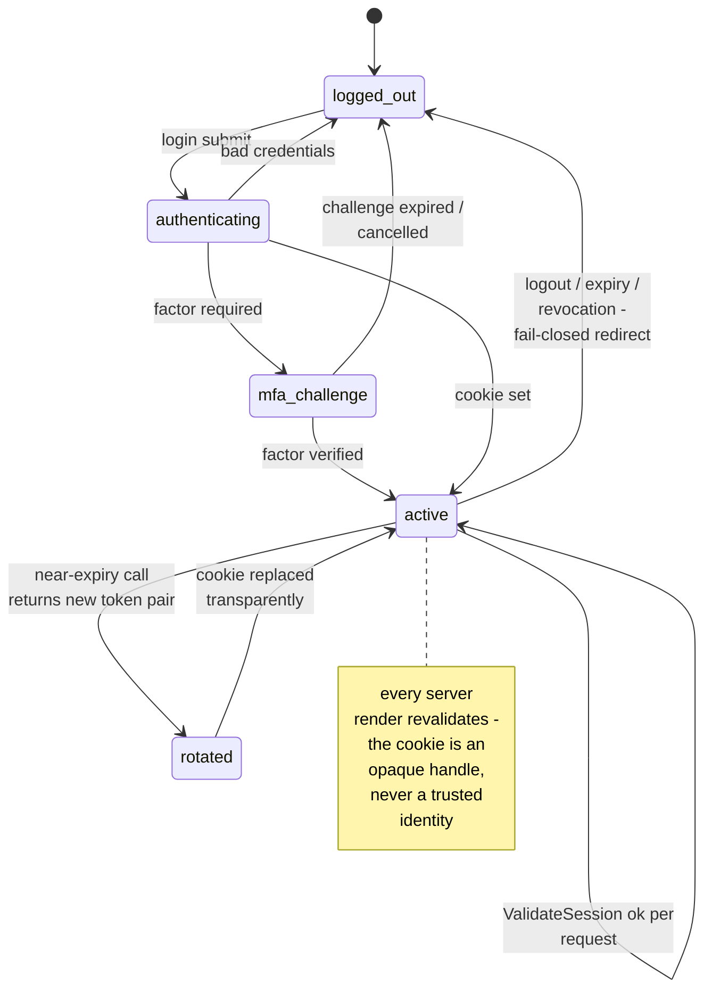

## State diagram - a Test Lab run

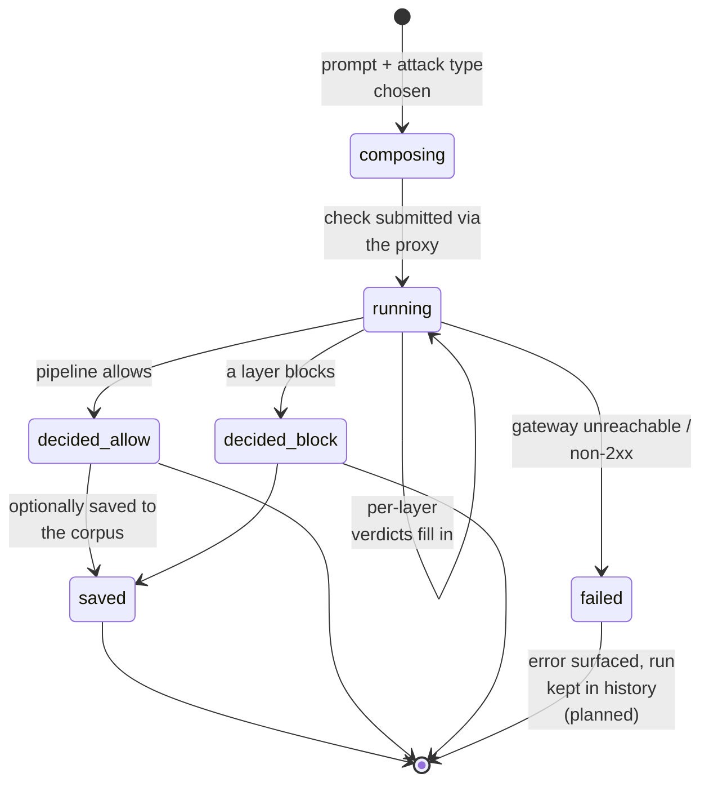

The run machine lives in the test-lab feature's domain layer (extraction in progress) so the dashboard quick-probe and the full workbench share one implementation instead of drifting copies.
