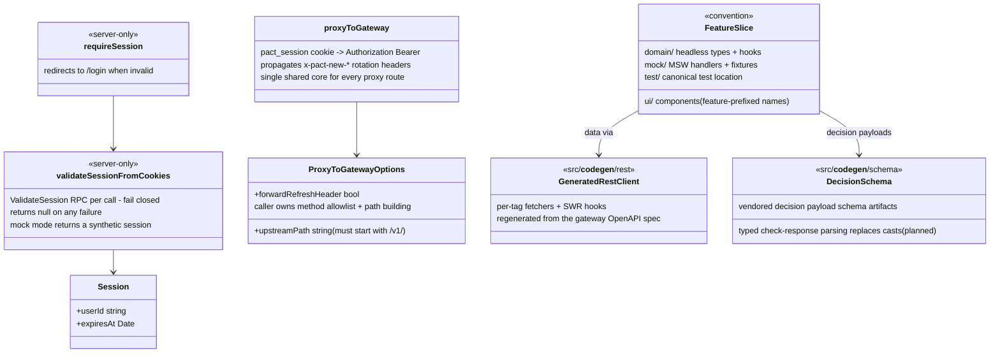
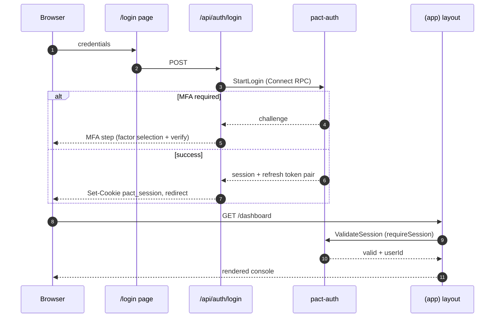
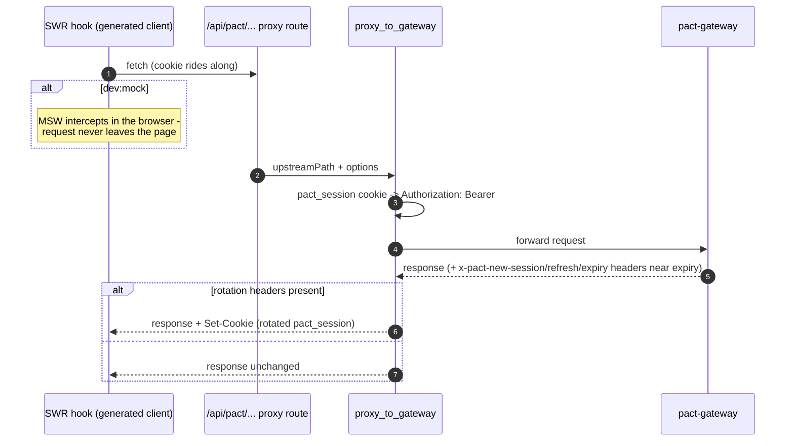
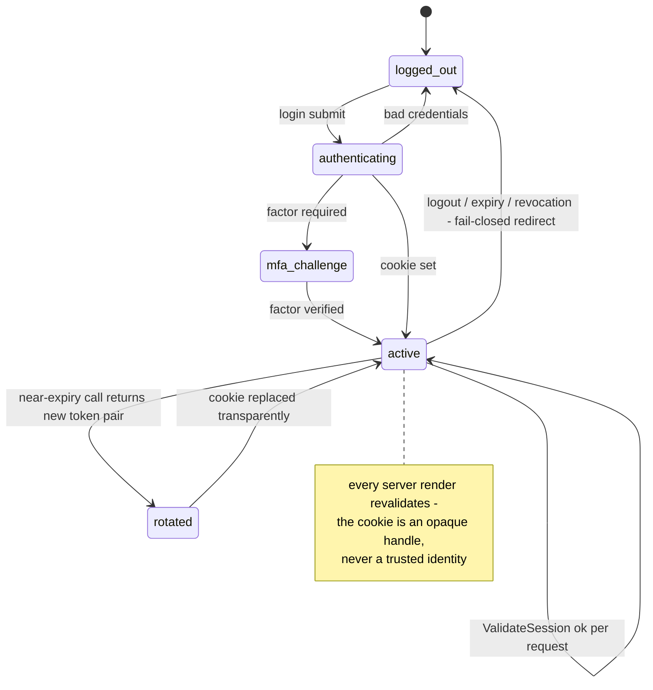
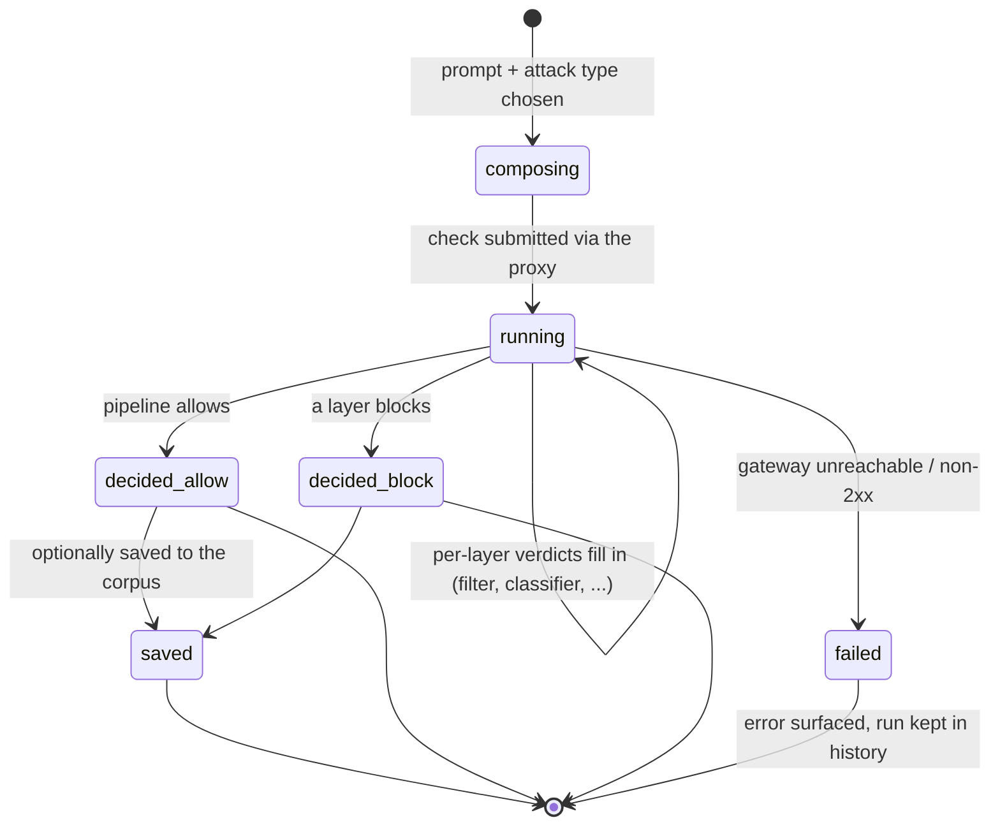

# pact-web - architecture

C4 Level 3/4 views of pact-web, plus its dynamic views.
Like the README diagram, these show the target architecture the project is converging on; pieces not yet merged are marked "(planned)".

## Component diagram (C4 L3)

## Class diagram (C4 L4) - session and proxy core

The cookie is never trusted directly: only what pact-auth's ValidateSession says about it counts, so a stale or forged cookie degrades to a login redirect rather than a stale identity.

## Sequence - login

## Sequence - proxied API call with session rotation

Rotation is transparent to feature code: the SPA never handles raw tokens - the proxy layer owns the cookie-to-Bearer translation and the rotated pair, so a new endpoint gets both for free by declaring a route on the shared core.

## State diagram - client session

## State diagram - a Test Lab run

The run machine lives in the test-lab feature's domain layer (extraction in progress) so the dashboard quick-probe and the full workbench share one implementation instead of drifting copies.
